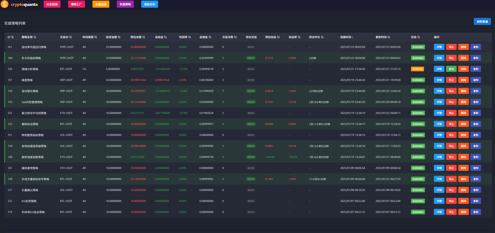
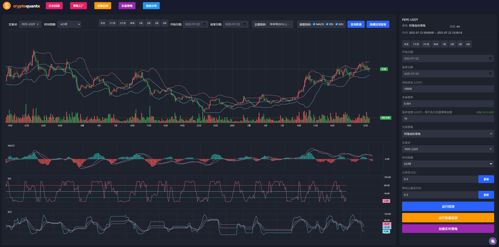
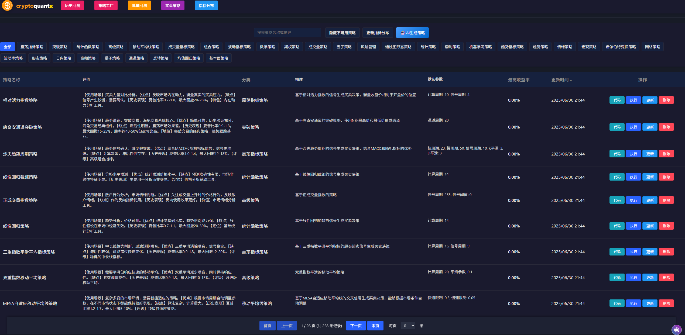
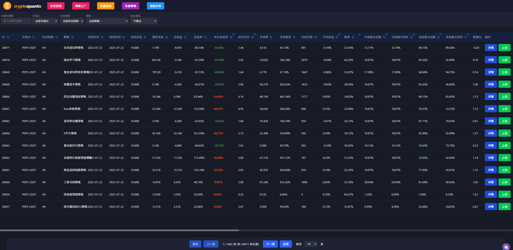
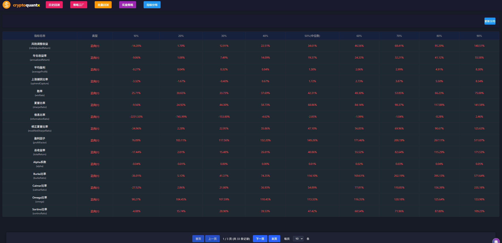

# CryptoQuantX

CryptoQuantX是一个专注于加密货币量化交易的平台，提供专业的K线图表展示、回测和实盘交易功能。

## 功能特点

- 专业K线图表展示，支持多种技术指标
- 实时市场数据查询和历史数据加载
- 交易对和时间周期自由切换
- 量化交易策略开发和回测
- 实盘交易接口集成
- 完整的回测系统和结果分析



## 回测系统

CryptoQuantX提供了功能强大的回测系统，支持多种量化交易策略的历史表现回测：


### 支持的策略

- **SMA (简单移动平均线)** - 基于短期和长期移动平均线的交叉信号产生买卖信号
- **MACD (异同移动平均线)** - 基于MACD线与信号线的交叉以及柱状图的变化产生买卖信号
- **RSI (相对强弱指标)** - 基于RSI指标的超买超卖区域产生买卖信号
- **Bollinger Bands (布林带)** - 基于价格突破布林带上下轨或回归中轨产生买卖信号


### 回测功能

- **参数化设置** - 自定义初始资金、交易对、时间周期、手续费率等关键参数
- **回测结果分析** - 计算并展示总收益、收益率、胜率、最大回撤、夏普比率等关键指标
- **回测汇总页面** - 查看和管理所有回测记录，支持排序和筛选功能
- **回测详情** - 查看每笔交易的详情信息，包括入场时间、价格、盈亏等
- **图形化展示** - 结合K线图直观展示交易时点和结果





### 使用方法

1. 选择策略类型（SMA、MACD、RSI或布林带）
2. 设置回测参数（初始资金、时间范围、交易对、时间周期、手续费率等）
3. 点击"运行回测"按钮开始回测过程
4. 查看回测结果，包括总体指标和交易详情列表
5. 通过"回测明细"按钮查看更详细的分析或通过"重新设置"按钮调整参数再次测试

## 技术栈

- React + TypeScript
- Redux 状态管理
- Lightweight Charts 图表库
- RESTful API 集成

## 快速开始

### 安装依赖

```bash
npm install
```

### 环境变量配置

复制环境变量示例文件并根据需要修改：

```bash
cp .env.example .env
```

主要配置项：

- `REACT_APP_ENABLE_STAGEWISE` - 控制Stagewise工具栏的显示（true/false，默认为false）

**注意：** Stagewise工具栏仅在开发环境下可用。

### 启动开发服务器

```bash
npm start
```

### 构建生产版本

```bash
npm run build
```

## API 接口

系统集成了以下API接口：

- `/api/market/fetch_history_with_integrity_check` - 查询已保存的历史K线数据
- `/api/market/fetch_history_with_integrity_check` - 获取并检查历史数据完整性
- `/api/backtest/ta4j/strategies` - 获取可用的回测策略列表
- `/api/backtest/ta4j/run` - 运行回测并返回结果
- `/api/backtest/summaries` - 获取回测汇总数据
- `/api/backtest/detail/{id}` - 获取特定回测的详细交易记录

## 项目结构

```
src/
  ├── components/      # UI组件
  │   ├── Chart/       # 图表相关组件
  │   ├── Backtest/    # 回测相关组件
  │   ├── DataLoadModal/ # 数据加载弹窗
  │   └── ...
  ├── pages/           # 页面组件
  │   ├── BacktestSummaryPage/ # 回测汇总页面
  │   ├── BacktestDetailPage/  # 回测详情页面
  │   └── ...
  ├── services/        # API服务
  ├── store/           # Redux状态管理
  ├── utils/           # 工具函数
  └── ...
```

## 贡献指南

欢迎提交问题和功能请求。对于重大更改，请先打开一个issue讨论您想要更改的内容。

## 许可证

[MIT](https://choosealicense.com/licenses/mit/)
